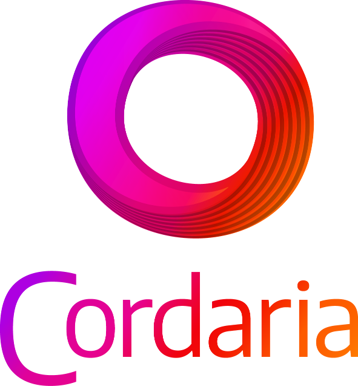

<p style="text-align:center; justify-content:center;"></p>

# What is?
Aimed at interested people in starting to study the acoustic and eletric guitar, cavaco and bass, as well as teachers of this art, the Cordaria project is a web application that aims to help students practice the instrument.

Developed by musician and programmer Lu Sacramento, the project is the result of research into new methodologies and approaches to distance music teaching.

# What does it do?
Its function is to generate basic typing exercises with a focus on technique. These exercises help the student to execute the given notes through tablature writing, with language that is easy to understand compared to sheet music writing.

This way, the student can practice with the help of a virtual “repeater”, at any time and place!

# How did it come about?
Using his knowledge from a decade as a teacher and a few years as a web developer, Lu implemented an application for practicing basic guitar and bass exercises based on some methods he had already experienced as a student and teacher. In this way, Cordaria intends to expand the methodological possibilities of practical teaching of these instruments in a distance learning setting and offer a different opportunity for initiation into the art of music making, in addition to encouraging programmers and teachers to think of new ways of learning.  
 <br />
## Setup
This application was developed with Nuxt 3 Framework and Mongodb Database. Look at the [Nuxt 3](https://nuxt.com/docs/getting-started/introduction) and [MongoDb](https://www.mongodb.com/docs/manual/introduction/) documentation to learn more.

### Environment Variables
```bash
# Create .env file from .env-exemple
cp .env.example .env
```
Put your data config variables like as host names and ports to will used it.

### Install dependencies
```bash
npm install
```

### Start development server
```bash
npm run dev
```
Start the development server on `http://localhost:8000`:
### Production
Build the application for production:
```bash
# build for production
npm run build

# start production server
npm run production
```
Start the production server on `http[s]://[your domain]`:

## Contributing
**Help us to improve** this project!  
Pull requests are welcome. For major changes, please open an issue first to discuss what you would like to change.

## Credits
**Developer**: Lu Sacramento;  
**Designer**: Gabriel Barreto.
### partners
* **Marketing**: IVM Digital;
* **Social Media**: Matheus Henrique Design;
* **Council**: Barracão das Ideia.

### sponsors
>*<p style="text-align:center; font-size:xx-small" >"O projeto Cordaria 3.0 foi possível devido ao apoio da Lei Paulo Gustavo, Governo Federal, Ministério do Turismo e Secretaria Municipal de Cultura do município de Contagem, através da aprovação no EDITAL DE SELEÇÃO LEI PAULO GUSTAVO - Nº 004/2023 - FOMENTO AO AUDIOVISUAL DE CONTAGEM, sob nº 249364."</p>*


<p style:="text-align:center;"></p>


